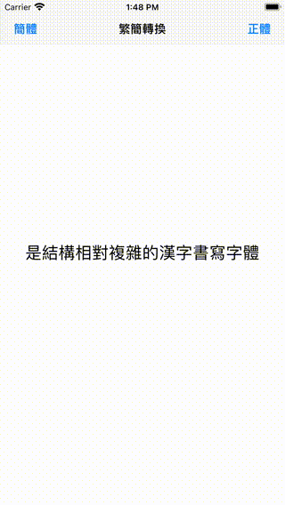

# WWJavaScriptContext+ChineseConvert
[](https://developer.apple.com/swift/) [](https://developer.apple.com/swift/)  [](https://developer.apple.com/swift/) [](https://developer.apple.com/swift/)

### [Introduction - 簡介](https://swiftpackageindex.com/William-Weng)
- [Use JavaScript to convert traditional and simplified Chinese text.](https://github.com/nk2028/opencc-js)
- [使用JavaScript進行繁簡中文的文字轉換。](https://cdn.jsdelivr.net/npm/opencc-js@1.0.5/dist/umd/full.js)



### [Installation with Swift Package Manager](https://medium.com/彼得潘的-swift-ios-app-開發問題解答集/使用-spm-安裝第三方套件-xcode-11-新功能-2c4ffcf85b4b)
```js
dependencies: [
    .package(url: "https://github.com/William-Weng/WWJavaScriptContext_ChineseConvert.git", .upToNextMajor(from: "1.1.0"))
]
```

### Function - 可用函式
|函式|功能|
|-|-|
|convert(_:to:)|繁體 <=> 簡體|

### Example
```swift
import UIKit
import WWJavaScriptContext
import WWJavaScriptContext_ChineseConvert

final class ViewController: UIViewController {

    @IBOutlet weak var myLabel: UILabel!
    
    override func viewDidLoad() {
        super.viewDidLoad()
    }
    
    /// 簡體 => 正體
    /// - Parameter sender: UIBarButtonItem
    @IBAction func convert_zh_TW(_ sender: UIBarButtonItem) {
        
        let traditionalChinese = WWJavaScriptContext.ChineseConvert.shared.convert(myLabel.text, to: .tw)
        myLabel.text = traditionalChinese
    }
    
    /// 繁體 => 簡體
    /// - Parameter sender: UIBarButtonItem
    @IBAction func convert_zh_CN(_ sender: UIBarButtonItem) {
        
         let simplifiedChinese = WWJavaScriptContext.ChineseConvert.shared.convert(myLabel.text, to: .cn)
         myLabel.text = simplifiedChinese
    }
}
```
